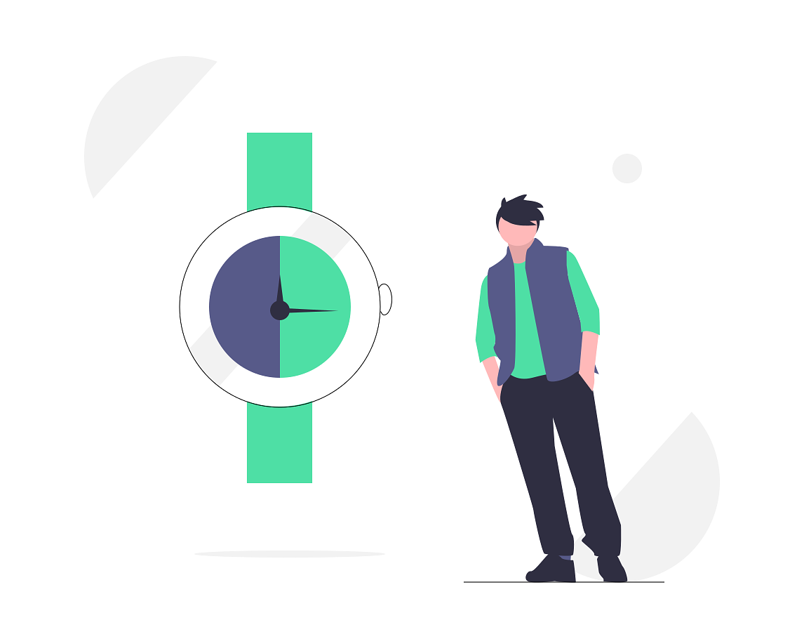
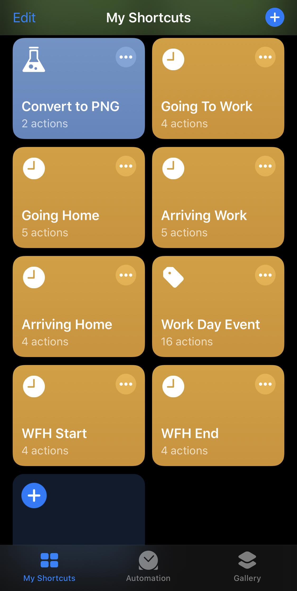
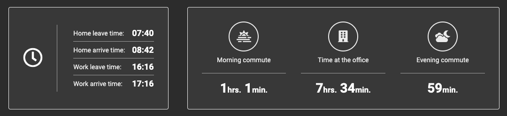
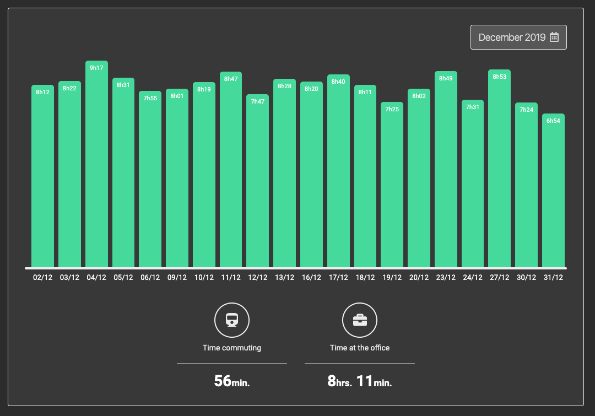

# Work commute webapp

Webapp for tracking how much time I spent commuting and working every day.

# Motivation

I am a bit obsessed with my own time and how it is being spent, and just like most of modern humans, we spend a good amount of our time working and commuting to work, so I though I could write a webapp to keep track of how much time I spend doing that.

Besides wanting to give myself a more full-stack challenge, I also wanted to learn some technical stuff that I did not have the chance of using before in an application, which are:

- Typescript
- Zeit Now
- GraphQL
- MongoDB
- React-hooks
- CSS-in-JS
- CSS Grid

And what is a better way of learning something other than getting your hands dirty with it? So there you go.

# How it works

The needs of a time tracker are very straight-forward, you have to log time and visualize it in a way you can clearly see how much time you're spending. So I though to have a more granular way of measuring time, I could just use a few events to mark when I started or stopped doing something so I could show more information.
As for visualization, now only I wanted a quick way to check how my day has been going, but also have a way of checking previous days, so I could have an idea of how much time I was spending on those past periods.

## Logging

This part was the one that had to put most thought on, I really wanted to simplify the way I can log those time events, otherwise this task would become tedious and there should be a way for this webapp to remind me or give me daily hints, otherwise I would end up forget doing it in a daily-basis.

At first I though of doing some scheduled browser push-notifications, but that would take me much more development time, so as I mentioned earlier I am very obsessed with time and I also really like to atomate some aspects of my life, so I really like the iOS Shortcuts app for making some repepetitive tasks more trivial, and while investigating its features, I noticed that you could do network requests on those shortcuts, so this was the perfect way of logging those time events.

On late 2019, there was an update on the Shortcuts app which you could now make automations to run shortcuts, and one of those automations involve geolocation, so you can trigger any shortcut depending on where you are arriving and leaving, so that was the perfect use case for the reminder need.

### Time Event API

In order for those shortcuts to work, I created a REST API that is simple enough for those shortcuts to call it, and I decided to use Zeit Now's serverless functions for creating small and simple functions that would become endpoints.

## Displaying the data

This was the most straight-forward part to think of, It had to be just that good old dashboard full of UI cards enhanced with data and a chart to display the data distributed over a period of time.

### Today section

This is for the most day-to-day use. I always want to check how much time I took to get to work or how much time I have been working already for that day.

### Period section

Here is where I would be able to visualize how a period has been. For now, it is only possible to select a month period, so the chart looks nicer and and is not cluttered and that have been proving to be enough so far.

# Challenges

There were a couple of challenges that I put to myself in order to learn some things that I really wanted.

### Hooks

Try to do all React related code using functional components, and to achieve that hooks were an amazing tool and was nice to start getting used to how they work and the caveats of only using hooks for common patterns that I was used to solve with classes' lifecycle callbacks. So far I have not seen any case that I would have been done better or easier with classes.

### GraphQL

Before this project I did only hello-world tiny projects to play around with it, but never had the pleasure of working with it, so I wanted to challenge myself to not only use GQL, but also to try to craft the resolvers and the schema in a way which the UI becomes very "dumb" and only worries about UI-specific state and logic, so all the business logic and data normalization processes are centered on the GQL side. And oh boy, how that was indeed proven to be a nice way to do things.

I haven't felt the need to install redux (or try to use mobx which I still want to create a project to use it) at any time, and it made things so much simpler. Coding the UI was a fluid and natural process of only thinking about how the UI is going to behave and nothing else.

Also I wanted to try-out something I always thought that GQL could shine, which is making per-component queries that gather only the data that is necessary for that component and nothing else, and apollo really helped making this process very pleasant, specially with its custom hook.

### Typescript

In all my career I have been mostly reluctant to using types on JS. At my first years, I have used strong-typed languages such as Java and C#, so when I've made the switch to dynamically typed languages such as PHP and Javascript that felt like freedom.

But as years went by on my career, working with lots of humans coding the same codebase have showed me that it is quite a challenge to maintain a good level of cohesion and "understandability" of the code you're reading and writing, so TS really helps with that. Not knowing the shape of data you're dealing with can, not only make things harder to reason about, but also help introducing bugs to the codebase.

But the one of the best parts of using it in this project was that I could catch bugs earlier and suddenly VSCode got super powers and the auto-complete was meaningfully helping me for the first time. Moving code around has also proven to be much a easier task.

### Hand-crafted UI components

I think one of the things I most love, if not the biggest, is crafting UI components that when you use them you "feel good". Something like "Aaahhh that's so smooth!", I love using websites and apps that offer that kind of experience so I had to be able to not only craft those components, but also make them feel smooth.

The biggest highlights for me are definitely the bar chart and the month picker. For the chart, I wanted to find a way which it would be pleasent how it presented it self, so that's why I decided to transition the bars, so it feels smooth when you're switching between periods. And for the month picker, I really wanted to make something that uses the "UI morphing" technique, which I believe is one of the best ways of showing the user that a context is being switched.

### It can be used on any viewport

Well, **it's fucking 2020.**

But seriously, you can't think of any web app without giving proper mobile support nowadays, so that by itself was already a challenge I had put to myself, to not only think about the UI on a desktop, but also a UI that can adapt to any viewport.

I also had the need of checking the data anytime I want, so no better than having proper mobile support.

### Micro-interactions

This is another aspect that I absolutely love about doing UI development. Handling all user micro-interactions in a smooth way is something I love to see and to do, so I tried to very attentious to those details.

Also I really like creating UIs that can handle all sorts of states in a more meaningful way. What I mean by that is that when something errors, I don't want to show a fucking pop-up saying "something went wrong" or if something is loading I don't want to show a page-filling spinner.

I believe UIs are much more pleasant and clear when the state of a piece of UI can also be shown right where the information is being displayed. That is why I chose to handle all request errors, loading and missing-data states right where the data is displayed, and by following the challenge of each dataful component having its own query made this task much easier.

# Features To-do

There are still some things that I want to create and fine-tune:

- "Add to home screen" support
- Display a nice UI when offline
- Display day events
- Give month picker proper mobile UI layout
- Query batching
- Fine-tune easings and transitions to favour smoothness
- Cover some UI edge-cases (e.g.: displaying something on not worked days)

# Project To-do

There is still much to be done to make this repository more organized:

- Improve folder structure
- DRY types
- More scalable folder structure
- Tidy-up big components
- Add instructions of how to run the project to the Readme file
